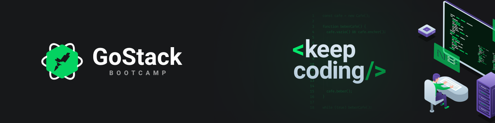

<h3 align="center">
  Desafio 02: Conceitos do Node.js
</h3>

## :rocket: Sobre o desafio

Nesse desafio, foi proposto criar uma aplicação para treinar o que foi ensinado no primeiro módulo de ReactJS.

Foi continuado o desenvolvimento da aplicação que armazena repositórios do portfólio do último [desafio](https://github.com/lucas-hgs/desafio-conceitos-nodejs) utilizando o Node.js.

## Ferramentas utilizadas

**ReactJS**

**AXIOS** - Para acessar a API do back-end.

## Como clonar e iniciar o projeto

1. Clone o projeto utilizando o seguinte comando: ```git clone https://github.com/lucas-hgs/desafio-conceitos-reactjs.git```

2. Após clonar, basta rodar um ```yarn``` para instalar as dependências.

3. Com o comando ```yarn start``` você consegue rodar em modo de desenvolvimento.

4. Para testar as funcionalidades, basta rodar ```yarn test```

---

Feito com 💜 por [Lucas](https://www.linkedin.com/in/lucas-hgs/) :wave: